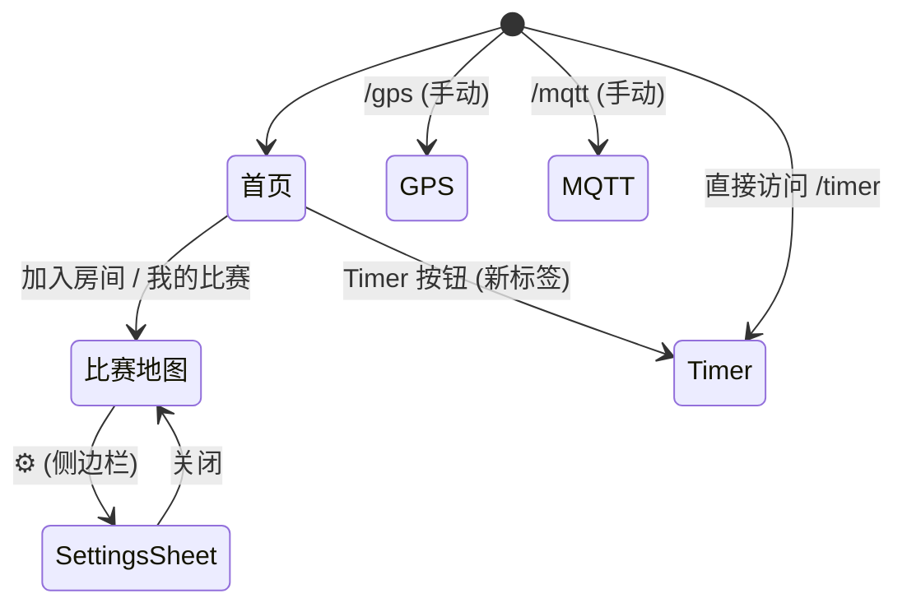

# 帆船裁判工具产品文档

> 版本：v0.9  
> 更新时间：2025-07-09

---

## 1. 用户画像与目标人群

| 角色 | 使用场景 | 设备 | 核心需求 |
| ---- | -------- | ---- | -------- |
| **裁判长 / 信号船管理员** | 在裁判船上创建并管理比赛；发布实时位置与航线 | 平板或手机（iOS / Android，Chrome / Safari） | 1. 简单创建比赛<br/>2. 可视化设置航线<br/>3. 将自身 GPS 位置实时广播给所有裁判 |
| **布标员（普通裁判）** | 根据裁判长广播的航线与坐标，在小艇上精确布置浮标 | 手机（GPS + Compass） | 1. 查看目标坐标及角度<br/>2. 获取自身实时坐标<br/>3. 使用定位/罗盘快速到达指定位置 |
| **计时员** | 在信号船或岸上准确记录启航、冲线等关键时间点 | 手机 / 平板 / PC | 1. 使用计时器工具<br/>2. 提前获取并监控关键时间节点 |

> 年龄层集中在 25-55 岁，具备基本智能手机 / 浏览器使用能力。

---

## 2. 主要功能

1. **比赛房间管理**  
   • 首次进入自动生成 6 位房间码（Base36，大写），即 *我的比赛*  
   • 输入房间码可加入任意比赛
2. **实时位置同步（MQTT）**  
   • 裁判长周期性发布自身坐标（retain）  
   • 布标员/观察者订阅后即时渲染；并上报自身位置  
   • 自动统计在线人数
3. **航线绘制与参数设置**  
   • 根据风向角、起航线长度、航程距离等参数自动计算起航线、1 标、4 标  
   • 插件化 CoursePlugin 体系，支持 simple / oneFour 等多种航线类型  
   • 设置面板实时预览、修改后即时广播
4. **布标辅助（Buoy Placement Assist）**  
   • 布标员实时查看目标坐标、航向、距离  
   • 利用手机 GPS + 指南针快速抵达并布置浮标
5. **方向与指南针辅助**  
   • 读取设备方向传感器，提供 *Compass* / *Course Axis* 切换  
   • 一键让地图正北朝上 / 以航线轴向为北
6. **计时工具（Timer）**  
   • 输入预告信号时间，自动推算准备、1 分钟、启航等关键节点  
   • 计算起航线、终点、抗议时限等辅助时间
7. **GPS 调试面板（开发/高级用户）**  
   • 实时显示原始坐标、航向、速度  
   • 支持 watch / 单次获取 / 自动重试
8. **MQTT 调试面板（开发/高级用户）**  
   • 订阅指定房间 Topic，查看原始发布 / 接收日志

---

## 3. 页面列表 & 信息架构

```mermaid
flowchart TD
  A[主页 /] -->|输入房间码| B(/race/{code})
  A -->|我的比赛| C(/race/{myId})
  A --> D(/timer)
  %% 隐藏调试入口
  click E href "/gps" "GPS 调试"
  click F href "/mqtt" "MQTT 调试"
  E[/gps]:::hidden
  F[/mqtt]:::hidden
  style E fill:#eee,stroke:#ccc,stroke-dasharray: 5 5
  style F fill:#eee,stroke:#ccc,stroke-dasharray: 5 5
```

说明：
- **/race/{id}** 页面根据 *id == myId* 判断角色：管理员 or 观察者。
- GPS / MQTT 调试页无导航入口，仅开发者通过地址访问。

### 3.1 导航设计

| 终端 | 入口 & 结构 | 页面间跳转 | 交互细节 |
| ---- | ----------- | ---------- | -------- |
| **桌面浏览器** | 顶部横向菜单：房间码输入框 + 主要按钮；右上角 **帮助 / 关于** 下拉 | 1. 输入房间码 → `/race/{code}`<br/>2. 点击 **我的比赛** → `/race/{myId}`<br/>3. 点击 **Timer** → 新标签页 `/timer` | 顶部菜单常驻；当前页面高亮；使用浏览器返回/前进控制层级 |
| **移动浏览器** | ~~屏幕右上角 Hamburger 图标；展开后显示 **帮助 / 关于** 及外链~~<br/>**统一采用顶部导航**：Logo + 房间码输入 / 主要按钮，右上角 **☰ Hamburger** | 1. 主卡片按钮流程同桌面<br/>2. 调试页无入口，需要手输地址 | 顶部栏固定于安全区域内；抽屉遮罩点击空白处关闭；菜单项点击自动折叠 |

> 说明：为避免移动端 *viewport* 高度随软键盘/地址栏变化导致底部导航错位，整个站点仅使用顶部导航及抽屉，不设计底部 Tab。

Race 页面内部导航：
1. 顶部栏左侧 **←**（浏览器返回）回到首页。
2. 右侧 **在线人数** 只读，无跳转。
3. 右侧工具栏（垂直）
   • **📍 Locate**：居中到当前位置（非跳转）  
   • **⚙ Settings**：管理员可见，侧边滑入设置面板（同页内）  
   • **ℹ Info**：弹出坐标对话框
4. SettingsSheet 关闭后返回地图视图；不离开页面。

Timer / GPS / MQTT 页面：
• 顶部标题旁 **🏠 返回** 图标，点击回到首页（替换或新标签页由浏览器控制）。

导航总览示意：


> 调试页不在主导航中，需直接输入 URL。

---

## 4. 页面功能明细

### 4.1 首页 `/`

| 区块 | 说明 |
| --- | --- |
| 房间码输入框 | 支持粘贴或手动输入 6 位大写码，自动转大写 |
| **加入比赛** 按钮 | 跳转到 `/race/{code}` |
| **进入我的比赛** 按钮 | 使用本地生成的房间码，若首次访问自动生成 |
| **Timer 计时器** 按钮 | 新窗口打开 `/timer` |
| 顶部菜单（桌面） | 帮助（外部链接） / 关于 |
| 更多菜单（移动端） | 帮助（外部链接） / 关于（含 “爸爸，果儿 编辑航线” / “工作支持” / “开源代码”） |

### 4.2 比赛地图 `/race/{id}`

公共功能：
- Leaflet 地图渲染；双指缩放、拖拽
- 顶部栏显示房间码、在线人数
- 底部信息卡持续展示 *Course Axis* 与 *Course Size*

| 角色 | 专属功能 |
| --- | --- |
| **管理员** | 1. GPS 更新即更新 *Signal Boat* 原点并重绘航线<br/>2. 右侧工具栏 *⚙️* 打开 SettingsSheet 修改航线参数<br/>3. 参数修改立刻通过 MQTT Retain 广播；观察端实时更新 |
| **观察者** | 1. 自动上报自身坐标到 `race/{id}/location/observer/{oid}`<br/>2. 地图居中到自身位置；支持 *定位* 按钮手动回中<br/>3. 罗盘/速度面板；点击显示最新坐标 & 时间戳 |

#### SettingsSheet（管理员侧面板）
- 选择航线插件：simple / oneFour ...
- 动态渲染参数表单（角度、距离、起航线长度等）
- 保存即调用 `publishNow()`

#### SideToolbar
- **📍 Locate**：平滑移动到当前位置
- **⚙️ Settings**：仅管理员可见
- **ℹ️ Info**：显示 1 标、起航线等坐标明细

#### 页面元素一览
| # | 元素 | 位置 | 描述 | 出现条件 |
|---|------|------|------|---------|
| 1 | **Map Canvas (`#map-root`)** | 全屏 | Leaflet 渲染底图、航线、多标记 | 始终显示 |
| 2 | **TopBar** | 顶部固定 | 房间码、在线人数指示 | 始终显示 |
| 3 | **InfoCard (Course Axis / Size)** | 底部中央浮层 | 展示航线轴向与距离 | 始终显示 |
| 4 | **CompassButton** | 右下角悬浮 | 切换地图旋转：0° / 以航线轴向为北 | 始终显示 |
| 5 | **SideToolbar** | 右侧垂直 | 📍 Locate / ⚙ Settings / ℹ Info | 观察者：无 ⚙；游客：全部隐藏 |
| 6 | **GpsPanel** | 顶部下方（观察者） | 显示速度(kt)、航向、GPS 状态 | 仅观察者 |
| 7 | **ObserversLayer** | 地图叠加层 | 显示其他观察者船位 | 仅管理员 & 其他观察者 |
| 8 | **SettingsSheet** | 右侧抽屉 | 航线插件选择与参数表单 | 点击 ⚙（管理员）|
| 9 | **CoordinatesDialog** | 中央弹窗 | 显示各关键点 (Start Line / Mark 1…) 坐标 | 点击 ℹ |
|10 | **ErrorBanner** | 顶部浮层 | GPS / 权限错误提示 | 有错误时显示 |

> 所有浮层采用 `z-index` 分层，确保在地图交互之上，同时使用 `pointer-events` 管理点透。

### 4.3 计时器 `/timer`

- 输入 *预告信号*、*第一个终点*、*最后一个终点* 的绝对时间（HHMM 或 HHMMSS）
- 实时计算并高亮关键时间点：准备、1 分钟、启航、起航线限制、终点时限…
- 采用本地时间，每秒刷新当前时间

### 4.4 GPS 调试 `/gps`（隐藏）

- 启动 / 停止连续定位（`watchPosition` + 自适应 fallback）
- 实时列表展示：时间、纬度、经度、航向（GPS vs 设备）、速度 (kts)
- 错误与重试日志

### 4.5 MQTT 调试 `/mqtt`（隐藏）

- 文本框输入 6 位房间码 → 一键订阅 `race/{id}/location/admin` & `race/{id}/route`
- 实时打印发送 / 接收消息，便于现场调试网络或 Broker

---

## 5. 非功能需求

| 分类 | 要求 |
| ---- | ---- |
| 性能 | 地图首次加载 < 2s（4G 网络）；航线重绘 < 100ms |
| 兼容 | 支持 iOS 15+ Safari、Android 10+ Chrome、Chrome / Edge 桌面浏览器 |
| PWA | 未来版本支持离线缓存 & A2HS 安装 |
| 数据安全 | 生产环境启用 TLS，MQTT 帐号密码或 Token 鉴权 |

---

## 6. 未来规划

- 驾船航迹回放 / 导出
- 多角色：竞委、运动员视图
- 后端 API：赛事信息 & 成绩录入
- 离线地图 & 海图图层

---

> 如有问题或建议，请联系 *@sail-map* 项目维护者或提交 GitHub Issue。
