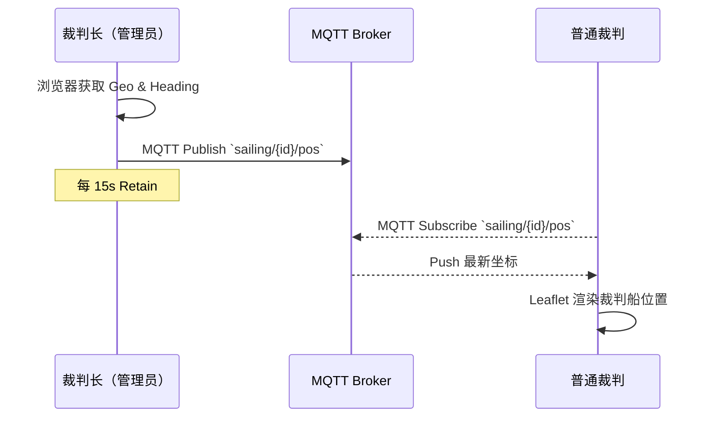

# Sail Map 项目架构与业务逻辑

> 更新时间：2023-10-xx

---

## 1. 功能概述

Sail Map 聚焦于 **帆船裁判** 工作流，为裁判船与岸上/水面其他裁判提供以下能力：

1. **实时位置同步** —— 裁判船周期性发布自身 GPS 坐标，其他终端实时订阅。 
2. **航线可视化** —— 根据风向、起航线、航程距离等参数绘制起航线、1 标等关键点。 
3. **指南针与朝向提示** —— 移动端读取设备方向传感器（`DeviceOrientation`），辅助裁判快速校准方向。 
4. 预留 **比赛管理**、**成绩录入**、**多语言** 等扩展模块。

---

## 2. 技术架构

```
┌─────────────┐      MQTT/WebSocket     ┌──────────────┐
│   Admin     │  ───────────────────▶  │   MQTT Broker │
│ (Signal Boat)│                       │   (EMQX)     │
└─────────────┘◀───────────────────    └──────────────┘
        ▲          Realtime Pos            ▲
        │                                   │
        │                                   │
┌─────────────┐                       ┌─────────────┐
│  Observer   │      Web  / PWA       │  Observer   │  ...
│   (Judge)   │ ◀───────────────────▶ │  (Judge)    │
└─────────────┘     Next.js 13         └─────────────┘
```

### 2.1 前端
- **框架**：Next.js 13（App Router） + React 18 + TypeScript。
- **地图渲染**：Leaflet + Carto 图源。
- **实时通信**：`mqtt.js` 通过 **WebSocket** 直连 Broker，实现浏览器原生 MQTT 连接。
- **状态管理**：以 *local state + React hook* 为主，后续可引入 Zustand / Redux Toolkit。

### 2.2 服务端
- **MQTT Broker**：开发环境默认使用 `broker.emqx.io` 公共实例；生产建议自建 EMQX/ Mosquitto 并开启 TLS/ 鉴权。
- **后端 API（TODO）**：当前版本为纯前端 SPA；未来可引入 Next.js Route Handler 或独立后端提供赛事与人员管理接口。

---

## 3. 核心业务流程



### 3.1 房间码与角色识别
1. 首次进入站点自动生成 **6 位 Base36 大写** 房间码 `RC1234` 并存入 LocalStorage。
2. 当访问 `/race/{id}`：
   - 若 `id == myId` => 视为 **管理员**；具备发布权限。
   - 否则视为 **观察者**，仅订阅。 

### 3.2 航线绘制算法
1. 依据风向 *WIND_DIRECTION* 及起航线长度 *START_LINE_LENGTH_M* 计算起航标坐标（`destinationPoint`）。
2. 起航线中心点沿风向延伸 *COURSE_DISTANCE_NM* 海里，得到 **1 标** 坐标。
3. Leaflet 使用不同颜色 Polyline / CircleMarker 完成渲染。

---

## 4. 数据模型

| 字段            | 类型  | 说明                              |
| --------------- | ----- | --------------------------------- |
| `id`            | str   | 发送者身份，固定 `ADMIN`           |
| `lat` `lng`     | float | WGS-84 坐标                       |
| `course.axis`   | int   | 风向 / 航线轴向 (0-359°)           |
| `course.distance_nm` | float | 起航线中心至 1 标距离 (海里) |
| `course.start_line_m`| int   | 起航线长度 (米)                 |
| `timestamp`     | int   | Unix 毫秒时间戳                   |

---

## 5. 未来规划
- [ ] **离线缓存**：断网状态下缓存最后一次航线 & 位置。
- [ ] **PWA**：支持安装到主屏幕、离线资源缓存。
- [ ] **权限分级**：加入裁判、竞委会、运动员等多角色。
- [ ] **后台管理**：赛事数据 CRUD、成绩录入、回放。

### 2025-06 插件化重构

- 引入 Course Plugin 机制，目录 `src/features/course/plugins`。
- 每条航线实现 `CoursePlugin` 接口：`id / name / paramSchema / defaultParams / draw()`。
- 当前内置：
  - **simple**：角度 + 距离 + 起航线长度。
  - **oneFour**：角度 + 距离 + 起航线长度 + 4门宽度 + 4门距离。
- 状态存储改为 `{ type, params }`，并向后兼容旧字段。
- SettingsSheet 面板自动渲染 `paramSchema`，支持动态切换航线类型。
- MQTT Payload 统一：
  ```json
  {
    "lat": 39.9,
    "lng": 116.4,
    "course": {
      "type": "oneFour",
      "params": { "axis": 40, "distanceNm": 1.0, "mark4Width": 50, "mark4Dist": 150, "startLineM": 100 }
    }
  }
  ```
- 管理端修改航线后 `publishNow()` 会立即发送 retain 消息；观察端实时更新。

---

如有建议或 PR，欢迎在 GitHub Issue 中讨论。 